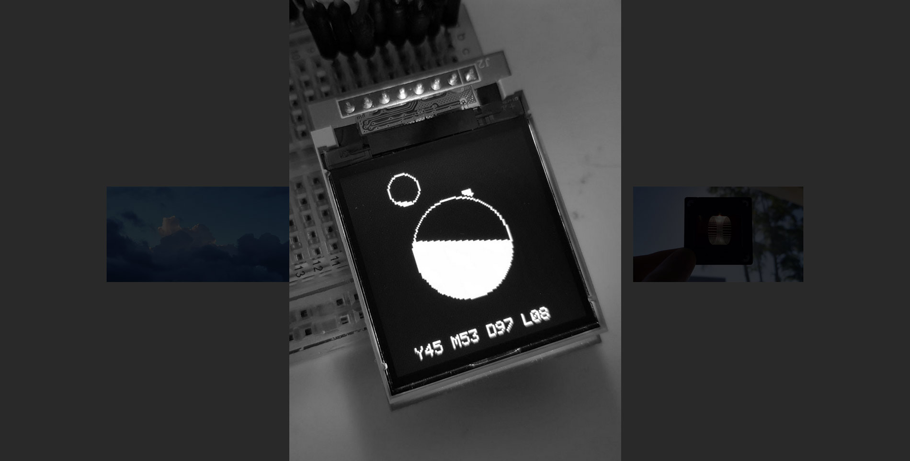

Minimal vanilla js lightbox for images

[**Live example**](https://kormyen.github.io/lightbox/index.html)




#### Other Examples

- [Memex](https://kormyen.github.io/memex/) - [repo](https://github.com/kormyen/memex)
- [Shinestrength's Portfolio](http://www.shinestrength.xyz/) - [repo](https://github.com/shinestrength/memex)

#### Use

```
<head>
  <link rel="stylesheet" href="lightbox.css">
</head>
<body>
  <div class="lightbox"></div>
  
  <script src="lightbox.js"></script>
  <script>
    let lightbox = new Lightbox();
    lightbox.install(document.querySelector('.lightbox'), 'lightbox');
  </script>
</body>
```

#### Install

```
<script>
  let lightbox = new Lightbox();
  lightbox.install(container, 'prefix');
</script>
```

|         param | description                                      |
|          ---: | :---                                             |
|     container | containing div for lightbox to use               |
|        prefix | css class name prefix for 'x-img' and 'x-back'   |

#### Load
```

<script>
  let image = document.querySelector(".image");
  lightbox.handle(image, image.src);
</script>
```
or
```
<script>
  let image = document.createElement('img');
  image.src = 'image.jpg';
  this.addEvent(image, 'click', function(){ lightbox.load('image.jpg'); });
  document.body.appendChild(image);
</script>
```
or
```

<script>
  let image = document.querySelector(".image");
  image.addEventListener('click', function(){ lightbox.load('image.jpg') });
</script>
```
or
```

```
etc

---

[CC0](LICENSE)

